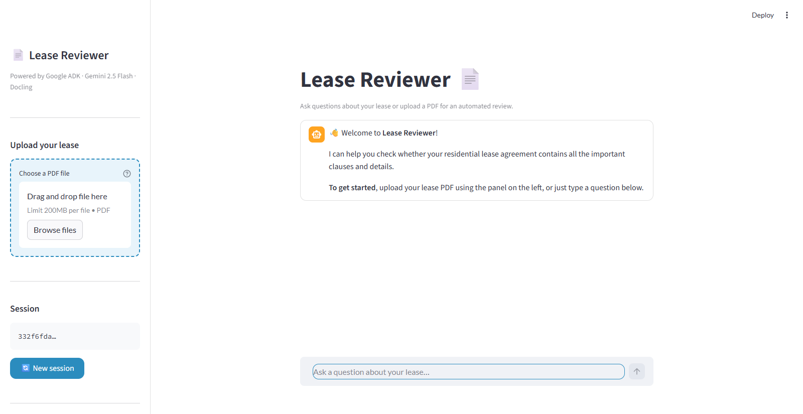
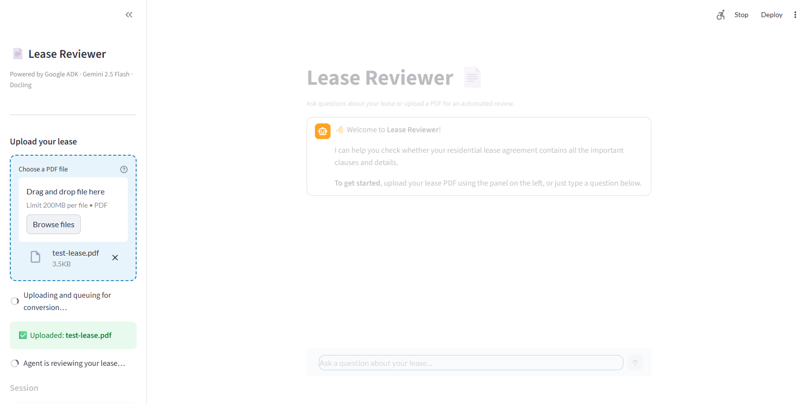
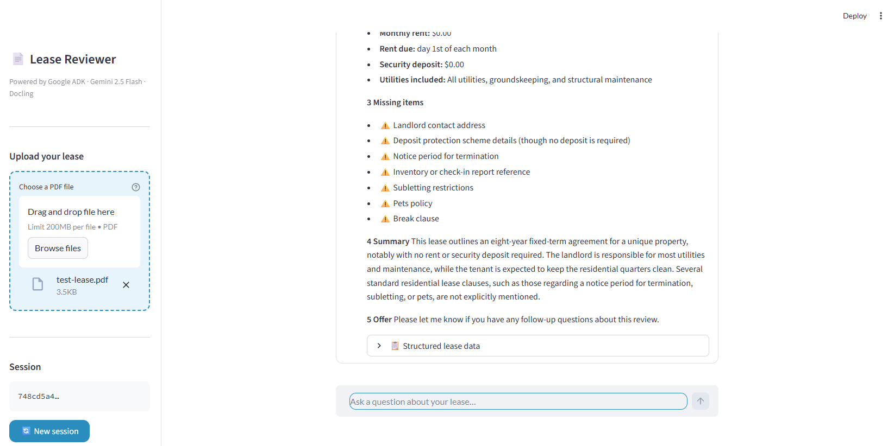

## Why This Demo Exists

::: {.callout-note appearance="simple"}
This repo is a **minimum reproducible example** of a sidecar-based AI workflow:
`Upload PDF -> convert with Docling -> analyze with ADK agents -> return structured lease insights`.
:::

- Goal: show architecture choices, not just model output.
- Audience: someone who has never seen this repository before.
- Outcome: understand what to run, how it works, and why sidecar + containers were chosen.

## What The Service Does

:::: {.columns}
::: {.column width="55%"}
1. User uploads a lease PDF in Streamlit.
2. FastAPI stores it in shared `/uploads`.
3. ADK tool calls Docling sidecar to convert PDF to Markdown.
4. Checklist sub-agent extracts key terms and missing clauses.
5. Frontend shows prose + structured JSON.
:::
::: {.column width="45%"}
```{text}
frontend:8501  ->  api:8001
                 ->  adk:8000
                 ->  docling:5001
```
:::
::::

## System Architecture

```{text}
Docker Compose Network

frontend (:8501) -> api (:8001) -> adk (:8000) -> docling (:5001)
      ^                 |             |
      |                 |             +-- root agent + checklist sub-agent
      +-----------------+                stores lease_markdown in session state

uploads/ volume shared by frontend + api + adk
```

::: {.callout-tip appearance="simple"}
Docling is isolated as its own service so document conversion can scale and fail independently.
:::

## Request Flow End-to-End

::: {.incremental}
- `POST /upload` stores PDF under `/uploads/<uuid>/file.pdf`.
- Frontend sends `POST /chat` with file path in message.
- API ensures ADK session exists, then calls `/run`.
- Root agent calls `convert_pdf_to_markdown` tool.
- Tool posts PDF bytes to `docling/v1/convert/file`.
- Markdown is saved in session state as `lease_markdown`.
- Root transfers to checklist sub-agent for final user answer.
:::

## Agent Design

:::: {.columns}
::: {.column width="50%"}
### Root Agent

- Orchestrates workflow
- Detects upload path
- Calls Docling conversion tool
- Transfers to sub-agent
:::
::: {.column width="50%"}
### Checklist Sub-Agent

- Reads `lease_markdown`
- Produces plain-language review
- Lists missing terms
- Emits structured JSON block
:::
::::

::: {.callout-important appearance="simple"}
This split keeps orchestration logic separate from extraction/reporting logic.
:::

## Why Sidecar Pattern Fits Docling

- **Isolation**: heavy PDF processing does not compete with ADK orchestration loops.
- **Reliability**: health checks and `depends_on` gate startup until Docling is ready.
- **Replaceability**: Docling can be upgraded/swapped without rewriting agent flow.
- **Reusability**: other agents can call the same conversion sidecar.

::: {.callout-warning appearance="simple"}
Without a sidecar boundary, conversion failures or model warm-up delays can degrade the whole agent service.
:::

## Containerization Advantages Here

::: {.incremental}
- Reproducible local setup: `docker compose up --build` starts full stack.
- Stable interfaces via service DNS names (`api`, `adk`, `docling`).
- Per-service environment variables and runtime tuning.
- Resource controls for Docling (`cpus`, `memory`) reduce noisy-neighbor risks.
- Easy local parity with deployment targets.
:::

## Why Docling vs Basic OCR

:::: {.columns}
::: {.column width="50%"}
### Basic OCR engines

- Extract visible text only
- Often flatten layout order
- Lose section boundaries/tables
- More post-processing burden
:::
::: {.column width="50%"}
### Docling in this stack

- Converts to **structured Markdown**
- Preserves headings/list structure better
- Better downstream prompt quality
- More reliable clause/checklist extraction
:::
::::

::: {.callout-note appearance="simple"}
The downstream agent quality depends heavily on document structure quality.
:::

## Frontend Walkthrough (1/3)



::: aside
Captured from local `http://localhost:8501`.
:::

## Frontend Walkthrough (2/3)



::: {.callout-tip appearance="simple"}
This in-progress step is useful to demo that upload, session creation, and background analysis are decoupled.
:::

## Frontend Walkthrough (3/3)



::: {.callout-tip appearance="simple"}
This completed state shows the final output format: prose review followed by structured JSON. Both are generated by the checklist sub-agent using the Docling-converted Markdown.
:::

## Demo Commands

```bash
# Start all services
docker compose up --build

# Optional smoke checks
bash tests/test_services.sh

# Render slides to docs/index.html
quarto render docs/index.qmd

# Publish to GitHub Pages (gh-pages branch)
quarto publish gh-pages --no-browser
```

## Recap

- The service turns raw lease PDFs into actionable review output.
- Sidecar + multi-agent split improves maintainability and resilience.
- Containers make the full demo reproducible.
- Docling provides higher-structure input than plain OCR, improving downstream extraction quality.

::: {.notes}
Emphasize that this repository is intentionally small but production-oriented in architecture choices.
:::
